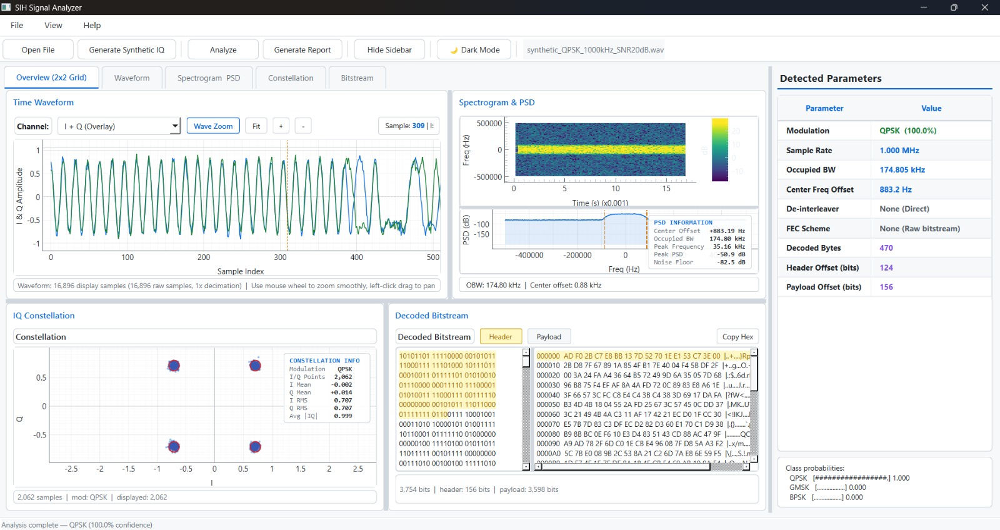
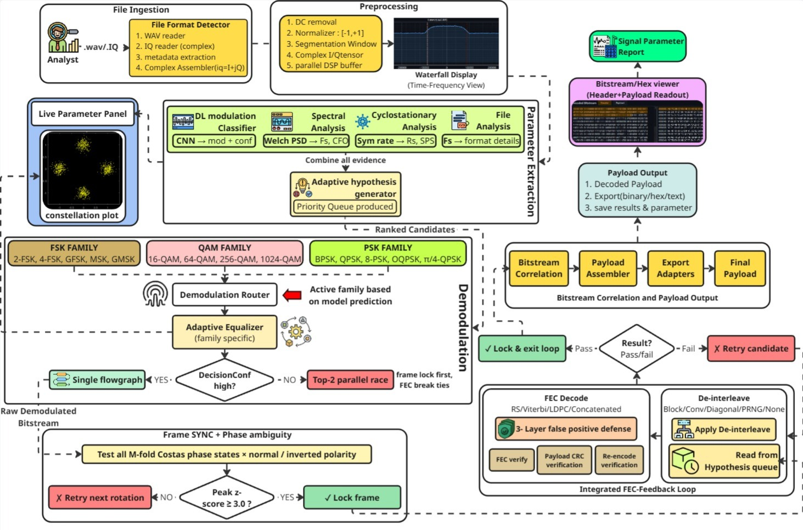
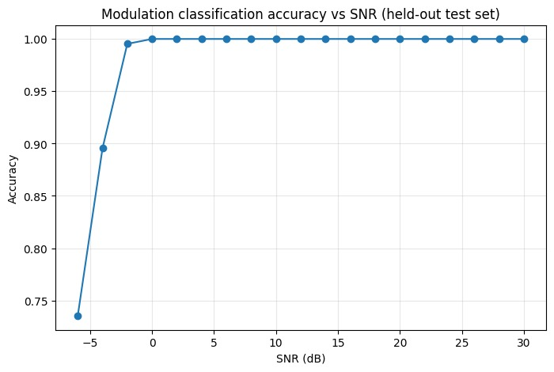
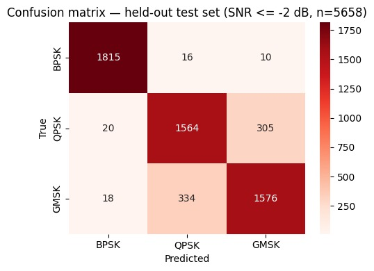

# Sanchar (संचार) — Automated RF Signal Analyzer

<div align="center">

<!-- Team Logo -->


<br />

# Sanchar (संचार)
### Automated Model for Analysis of .IQ and .wav Files along with Signal Parameter Extraction
**An Intelligent Deep Learning + GNU Radio / Python / C++ DSP Pipeline with a Feature-Rich Interactive GUI**

<p align="center">
  <em>"From raw signals to smart insights"</em>
</p>

<p align="center">
  
  
  
  
</p>

<p align="center">
  
  
  
  
  
  
  
</p>

</div>

---

> **Sanchar (संचार)** is an autonomous, end-to-end RF signal analysis and parameter extraction system engineered with **Python, PyTorch, and GNU Radio C++ DSP acceleration**, coupled with a high-performance **PyQt6 / PyQtGraph operational desktop dashboard**. Built by **Team Caffeine Coders** for **Smart India Hackathon (SIH 2026)** under the **National Technical Research Organisation (NTRO)**, Sanchar ingests raw off-the-air `.IQ` and `.wav` signal recordings across HF, VHF, and UHF bands, autonomously extracting signal parameters, demodulating multi-family waveforms, resolving interleaving topologies, executing Forward Error Correction (FEC), and correlating bitstreams for robust header and payload identification—with zero prior signal metadata.

---

## 📑 Table of Contents

- [Problem Statement & Background](#-problem-statement--background)
- [Proposed Solution & Core Pipeline](#-proposed-solution--core-pipeline)
- [Five Core Mandated Tasks](#-five-core-mandated-tasks)
- [Interactive GUI Dashboard Tour](#-interactive-gui-dashboard-tour)
- [Technical Approach & System Architecture](#-technical-approach--system-architecture)
- [Technology Stack](#-technology-stack)
- [Feasibility, Viability & What Sets Sanchar Apart](#-feasibility-viability--what-sets-sanchar-apart)
- [Mathematical Foundations & Algorithmic Pipeline](#-mathematical-foundations--algorithmic-pipeline)
- [3-Tier Validation Gate & False-Positive Defense](#-3-tier-validation-gate--false-positive-defense)
- [Empirical Validation & Benchmark Results](#-empirical-validation--benchmark-results)
- [Live Execution Trace (Stage-by-Stage Forensic Breakdown)](#-live-execution-trace-stage-by-stage-forensic-breakdown)
- [Built-in Synthetic Signal Generator](#-built-in-synthetic-signal-generator)
- [Workspace Architecture & Subsystems](#-workspace-architecture--subsystems)
- [Installation & GUI Launch Guide](#-installation--gui-launch-guide)
- [Team & Acknowledgments](#-team--acknowledgments)
- [License](#-license)

---

## 🎯 Problem Statement & Background

### 📌 Problem Statement Overview
| Parameter | Official Specification |
| :--- | :--- |
| **Problem Statement ID** | **SIH26147** |
| **Problem Statement Title** | **Automated model for analysis of .IQ and .wav files along with signal parameter extraction** |
| **Organization** | **National Technical Research Organisation (NTRO)** |
| **Category** | **Software** |
| **Target Bands** | **HF, VHF, UHF (kHz to GHz spectrum)** |
| **Developing Team** | **Team Caffeine Coders** (Government College of Engineering and Leather Technology, Kolkata) |

### 📖 Background
The raw data for analysis of signals collected off the air typically ranges from a few kHz to GHz bands. The analysis has traditionally been carried out manually to identify signal parameters, and the resultant data is then utilized for processing signals in designated sensors. However, manual analysis is labor-intensive, slow (taking 2 to 6 hours per intercept), and often insufficient for fine-grain analysis for parameter extraction—such as modulation type, sampling rate, FEC, interleaving, etc. This creates an urgent operational need for advanced automated data processing to extract reliable observation data rapidly.

### 📝 Problem Description
Terrestrial signals received from various sources include data across the **HF, VHF, and UHF bands**. The raw data is collected in the form of `.wav` or `.IQ` format to retain the intrinsic characteristics of the waveform. The analysis of signals is primarily dependent on the basic characteristics of data points selected during the recording of these signals.

Because data points are recorded from **different sensors and different locations**, parameters vary widely. Therefore, data available for analysis is often insufficient to clearly identify fine details such as sampling rate, modulation type, interleaving, and FEC. Furthermore, data saved as `.IQ` and `.wav` have different structural parameters and store raw information in different formats, requiring specialized, differentiated processing chains for signal analysis to extract signal parameters.

**Sanchar** solves this challenge through an intelligent hybrid architecture using **GNU Radio, Python, and C++**, leveraging spectral relationships derived from training and conditioning data containing both `.IQ` and `.wav` formats to extract signal parameters, perform deep analysis, and accurately demodulate intercepted signals.

---

## 💡 Proposed Solution & Core Pipeline

### 🌟 Core Architectural Pillars
- **Unified Pipeline:** Ingest $\to$ Process $\to$ Estimate in a single automated end-to-end flow.
- **Hybrid DL + DSP Core:** 1D Convolutional Neural Network (CNN) for noise-resilient modulation recognition paired with precision GNU Radio C++ Costas loops and polyphase clock synchronizers.
- **Blind De-Interleaving:** Multi-hypothesis search (Block, Convolutional, Diagonal, Pseudo-Random) dynamically validated through downstream algebraic decoding feedback.
- **GUI-Based & Fully Offline:** Intuitive PyQt6 desktop application requiring zero cloud connectivity, CPU-friendly, and air-gapped ready for secure defense and intelligence operations.

### 🔄 The 10-Step Signal Exploitation Pipeline
```
[Ingest]    Load raw RF captures (.wav, .IQ) across HF to UHF bands.
   ↓
[Detect]    Identify file format, sample rate, and data type (float32, int16, uint8).
   ↓
[Normalize] Remove DC LO leakage; scale I/Q samples to [-1.0, +1.0].
   ↓
[Window]    Slice stream into 1024-sample frames for neural inference.
   ↓
[Classify]  1D-CNN classifies modulation family (PSK, QAM, FSK) with confidence scoring.
   ↓
[Analyze]   Estimate Fs, Rs, and SPS via Welch PSD and Oerder-Meyr cyclostationary transforms.
   ↓
[Demodulate]Costas Loop and Polyphase Clock Sync recover raw constellation symbols.
   ↓
[Sync]      Cross-correlate candidate preambles to resolve Costas phase ambiguity and lock frames.
   ↓
[De-Interleave] Blind search evaluated and confirmed dynamically via FEC syndrome feedback.
   ↓
[FEC Decode]Multi-scheme decoding (Viterbi, Reed-Solomon, Concatenated, LDPC) outputting payload.
```

### 🚀 Operational Advantages
- **Blind Detection:** Recovers transmitted data without prior transmission metadata.
- **Dramatically Faster:** Reduces manual analysis turnaround from **2–6 hours down to a few seconds**.
- **Thoroughgoing:** Simultaneously extracts all 5 primary signal parameters plus auxiliary spectral attributes.
- **Portability:** CPU-only operational mode, fully offline, and easily deployable in field environments.

---

## 🎯 Five Core Mandated Tasks

The Sanchar desktop platform satisfies all requirements mandated by the official problem statement:

```
+----------------------------------------------------------------------------------------------------+
|                         SANCHAR CORE FUNCTIONAL MANDATE & CAPABILITIES                             |
+----------------------------------------------------------------------------------------------------+
|  [Task i]   Identify Signal Parameters   : Sampling freq, Modulation, FEC, Interleaving, OBW, CFO  |
|  [Task ii]  Demodulate Signals           : FSK (2-FSK, 4-FSK, GMSK, MSK), QAM, PSK (BPSK, QPSK)    |
|  [Task iii] Blind De-Interleaving        : Block, Convolutional, Diagonal, Pseudo-Random           |
|  [Task iv]  FEC Decoding                 : Viterbi (short-constrained conv), RS block, Concatenated|
|  [Task v]   Bit Stream Correlation       : Frame sync, preamble lock, header & payload isolation   |
+----------------------------------------------------------------------------------------------------+
```

### 1. Identify Signal Parameters (Task i)
- **Modulation Scheme:** 1D-CNN modulation classification across PSK, QAM, and FSK families.
- **Sampling Frequency ($F_s$):** Extracted from WAV headers or estimated spectrally for raw binary `.IQ`.
- **Occupied Bandwidth (99% OBW):** Computed via integrated Welch Power Spectral Density periodogram.
- **Carrier Frequency Offset (CFO) & Noise Floor:** Evaluated across the power spectral distribution.
- **Interleaving Scheme & FEC Code:** Inferred through multi-hypothesis testing and algebraic syndrome verification.

### 2. Demodulate Signals (Task ii)
- **PSK Family:** BPSK, QPSK, 8-PSK, OQPSK, $\pi/4$-QPSK via 2nd-order Costas loop carrier tracking and Root Raised Cosine (RRC) polyphase clock synchronizers.
- **FSK / CPM Family:** 2-FSK, 4-FSK, MSK, GMSK via quadrature FM discriminator and Gaussian matched filtering.
- **QAM Family:** 16-QAM, 64-QAM, 256-QAM, 1024-QAM constellation slicers with decision-directed AGC.

### 3. Blind De-Interleaving (Task iii)
- **Block Interleavers:** Rectangular matrix interleavers ($4\times 8$, $8\times 8$, $16\times 16$, $M\times N$).
- **Convolutional Interleavers:** Shift-register delay lines (Ramsey-II / Forney).
- **Diagonal Interleavers:** Diagonal matrix delay distributions.
- **Pseudo-Random (PRNG):** Algorithmic seed-based index permutations.

### 4. Forward Error Correction (FEC) (Task iv)
- **Short-Constrained Convolutional Codes:** Viterbi trellis decoding supporting CCSDS $k=7$ standard polynomials ($G_1 = 0o171$, $G_2 = 0o133$) and $k=3$.
- **Reed-Solomon Block Codes:** RS(128,120) and algebraic codes over $\text{GF}(2^8)$ with Berlekamp-Massey and Chien search verification.
- **Concatenated Codes:** Outer Reed-Solomon + Inner Viterbi convolutional decoding.
- **LDPC Decoding:** Structural framework for sparse parity-check matrix belief propagation.

### 5. Bit Stream Correlation (Task v)
- **Cross-Correlation Frame Lock:** Statistical peak-to-sidelobe cross-correlation across known preambles (Barker 7/11/13, sync markers, HDLC flags).
- **Costas Phase Ambiguity Resolution:** Tests candidate phase rotations ($0^\circ, 90^\circ, 180^\circ, 270^\circ$) and bit polarities, locking deterministically when $Z \ge 3.0$.
- **Header & Payload Isolation:** Automatically extracts preamble offsets, strips synchronization headers, and delineates clean payload bitstreams.

---

## 🖥️ Interactive GUI Dashboard Tour

The Sanchar interface is built entirely with **PyQt6** and GPU-accelerated **PyQtGraph** canvas widgets, providing analysts with rich, real-time feature visibility:

<div align="center">
  
  <p><em>Figure 1: Real-time Operational Dashboard of Sanchar executing automated signal parameter extraction and demodulation.</em></p>
</div>

### 1. Overview Grid & Time-Domain Waveform Display
- Displays continuous In-phase ($I$, blue) and Quadrature ($Q$, green) channel envelopes.
- Decimated rendering engine supporting smooth mouse-wheel zooming, box zoom, and horizontal panning across multi-megasample files.

### 2. Spectrogram & Welch PSD Waterfall
- **Waterfall Spectrogram:** Displays time-varying frequency shifts, burst activity, and frequency hopping.
- **Welch PSD Graph:** Interactive spectral curve displaying 99% Occupied Bandwidth ($173.83\text{ kHz}$), Peak Power ($-53.0\text{ dB}$), Noise Floor ($-85.0\text{ dB}$), and Carrier Frequency Offset ($-4.9\text{ Hz}$).

### 3. I/Q Constellation Scatter Plot
- Visualizes symbol decision clusters post-Costas Loop carrier lock and clock synchronization.
- **Real-Time HUD Telemetry:** Reads out symbol count, $I/Q$ mean offsets ($I_{\mu}, Q_{\mu}$), RMS dispersion ($I_{\text{RMS}}, Q_{\text{RMS}}$), and average magnitude ($|IQ|$).

### 4. Decoded Bitstream & Protocol Viewer
- Multi-tab inspection for **Decoded Bitstream**, **Header**, and **Payload**.
- **16-Byte Hex Dump:** Displays byte memory offsets, hex values, and ASCII representations with 1-click clipboard export.

### 5. Detected Parameters Telemetry Panel
- Real-time readout of identified modulation class, neural confidence %, sampling frequency, symbol rate, active de-interleaver, FEC scheme, decoded byte count, and header/payload bit offsets.

---

## 🏛 Technical Approach & System Architecture

<div align="center">
  
  <p><em>Figure 2: Comprehensive Modular Architecture and Dataflow of Sanchar.</em></p>
</div>

### 🔍 Architectural Dataflow Walkthrough
1. **File Ingestion:** Dual-reader subsystem ingesting `.wav` (with RIFF header metadata extraction) and raw `.iq` files, assembling continuous complex analytic arrays $s[n] = I[n] + jQ[n]$.
2. **Preprocessing:** Removes DC LO leakage, scales dynamic ranges to $[-1, +1]$, and generates parallel buffers for time-frequency waterfall rendering and DSP loops.
3. **Parameter Extraction Multi-Evidence Fusion:** Combines 1D-CNN confidence scores, Welch PSD spectral centroid data, Oerder-Meyr cyclostationary symbol rates, and header attributes into an **Adaptive Hypothesis Generator** producing a ranked priority queue.
4. **Adaptive Demodulation Router:**
   - Evaluates neural decision confidence. If high, dispatches directly to the specialized single flowgraph.
   - If ambiguous, spawns a **top-2 parallel race**, using downstream preamble lock and algebraic syndrome checks to break ties deterministically.
5. **Frame Sync & Ambiguity Resolution:** Tests all $M$-fold Costas phase states ($0^\circ, 90^\circ, 180^\circ, 270^\circ$) across normal and inverted bit polarities. Locks when peak cross-correlation $Z \ge 3.0$.
6. **Integrated FEC-Feedback Loop:** Inverts interleaving topologies and runs algebraic decoding. If syndrome residue or CRC fails, the candidate is discarded and the next hypothesis from the priority queue is evaluated.
7. **Payload Assembly & Export:** Strips header markers, validates payload CRC, renders synchronized hex/ASCII bitstreams, and compiles audit-ready vector A4 PDF and HTML reports.

---

## 🛠 Technology Stack

| Domain | Technology / Library | Operational Role |
| :--- | :--- | :--- |
| **Pipeline Control** | **Python 3.11** | Core application logic, dataflow coordination, and subsystem orchestration |
| **Desktop GUI** | **PyQt6** | Modern, dark-mode desktop user interface, multi-threaded QThread architecture |
| **Real-Time Visuals** | **PyQtGraph** | GPU-accelerated rendering for waveforms, PSD curves, and constellation scatter plots |
| **Interactive Spectral** | **Plotly** | Interactive 2D/3D time-frequency waterfall visualization |
| **Numerical Arrays** | **NumPy** | High-performance memory buffers, matrix operations, and complex sample arrays |
| **Signal Processing** | **SciPy** | FFT computation, bandpass/RRC filtering, Welch PSD, cross-correlation |
| **C++ DSP Engine** | **GNU Radio** | Native C++ runtime blocks for Costas loops, polyphase clock sync, and slicers |
| **Deep Learning** | **PyTorch** | 1D Convolutional Neural Network training and low-latency windowed inference |
| **Reporting Engine** | **xhtml2pdf / WeasyPrint** | Vector-rendered high-resolution A4 PDF and responsive HTML engineering reports |

---

## 💡 Feasibility, Viability & What Sets Sanchar Apart

### 🧩 Feasibility Dimensions
- **Technical Feasibility:** Built on proven, battle-tested scientific foundations—Python, GNU Radio, NumPy, SciPy, and PyTorch—combining analytical DSP precision with machine learning robustness.
- **Data Availability:** Trained and validated using standard RF benchmark datasets (RadioML) alongside pure-mathematics synthetic signal generators modeling real-world AWGN, CFO, and phase jitter.
- **Modular Subsystems:** Fully decoupled stages (Ingestion $\to$ Feature Extraction $\to$ Demodulation $\to$ De-interleaving $\to$ FEC) enabling isolated testing and continuous enhancement.
- **Desktop Integration:** Unifies signal visualization, deep learning inference, and C++ DSP processing inside a single, cohesive desktop platform.
- **Cost-Effective:** Completely open-source software stack requiring zero proprietary software licenses, costly hardware dongles, or cloud subscriptions.

### 📈 Viability & Operational Value
- **Real-World Impact:** Dramatically reduces manual analyst workloads when processing raw terrestrial HF, VHF, and UHF intercepts.
- **Operational Value:** Accelerates signal characterization, parameter extraction, and payload recovery from hours to seconds.
- **Scalability:** Easily extended with new modulation schemes, higher-order QAM grids, custom convolutional polynomials, or neural weights.
- **Long-Term Potential:** Serves as an indigenous, sovereign platform for spectrum enforcement, defense communications, and RF research.

### ⚔️ What Sets Sanchar Apart
| Feature | Conventional / Existing Solutions | **Sanchar (संचार)** |
| :--- | :--- | :--- |
| **Signal Analysis** | Fragmented, multi-tool workflows | **Unified All-in-One Desktop Platform** |
| **Processing** | Slow, manual parameter tuning | **100% Automated Parameter Extraction** |
| **Classification** | Disconnected standalone classifiers | **Integrated 1D-CNN with Softmax Calibration** |
| **Input Ingestion** | Tool-dependent, single format | **Dual `.IQ` and `.wav` with Auto-Detection** |
| **Architecture** | Closed black-box or rigid flowgraphs | **Modular, Extensible, and 100% Auditable** |
| **False-Positive Defense** | None / Manual validation | **3-Tier Gate (Syndrome, Z-Score, CRC)** |
| **Reporting** | Manual screen captures and text logs | **Automated Vector A4 PDF & HTML Reports** |

---

## 🧮 Mathematical Foundations & Algorithmic Pipeline

### 1. Analytic Quadrature Representation & Normalization
The intercepted RF signal is represented in complex baseband form:

$$r(t) = I(t) \cos(2\pi f_c t) - Q(t) \sin(2\pi f_c t) + n(t)$$

where $I(t)$ and $Q(t)$ are the in-phase and quadrature components, $f_c$ is residual carrier offset, and $n(t) \sim \mathcal{CN}(0, \sigma^2)$ is complex Gaussian noise. Power normalization over window length $N=1024$ ensures consistent neural and DSP scaling:

$$\tilde{s}[n] = \frac{s[n] - \mu_s}{\max(|I[n]|, |Q[n]|)}$$

---

### 2. Deep Learning 1D Convolutional Neural Network

Automatic Modulation Recognition is formulated as a maximum a posteriori classification problem:

$$
\hat{m} = \arg\max_{m \in \mathcal{M}} P(m \mid \mathbf{X})
$$

where $\mathbf{X} \in \mathbb{R}^{2 \times 1024}$ represents two-channel I/Q tensors.

1. **Stage 1 (Feature Extraction):**

$$
\mathbf{H}_1 =
\text{MaxPool}_{2}
\left(
\text{ReLU}
\left(
\text{BN}
\left(
\mathbf{W}_1 * \mathbf{X} + \mathbf{b}_1
\right)
\right)
\right)
$$

with kernel $k=7$.

2. **Stage 2 (Pattern Synthesis):**

$$
\mathbf{H}_2 =
\text{MaxPool}_{2}
\left(
\text{ReLU}
\left(
\text{BN}
\left(
\mathbf{W}_2 * \mathbf{H}_1 + \mathbf{b}_2
\right)
\right)
\right)
$$

with kernel $k=5$.

3. **Stage 3 (Hierarchical Encoding):**

$$
\mathbf{H}_3 =
\text{MaxPool}_{2}
\left(
\text{ReLU}
\left(
\text{BN}
\left(
\mathbf{W}_3 * \mathbf{H}_2 + \mathbf{b}_3
\right)
\right)
\right)
$$

with kernel $k=3$.

4. **Adaptive Aggregation & Dense Classification:**

$$
\mathbf{z} =
\mathbf{W}_{\text{fc2}}
\cdot
\text{Dropout}_{0.3}
\left(
\text{ReLU}
\left(
\mathbf{W}_{\text{fc1}}
\cdot
\text{AdaptiveAvgPool}(\mathbf{H}_3)
+
\mathbf{b}_{\text{fc1}}
\right)
\right)
+
\mathbf{b}_{\text{fc2}}
$$

$$
P(y=c\mid\mathbf{X}) =
\frac{e^{z_c}}{\sum_{j=1}^{C}e^{z_j}}
$$

---

### 3. Spectral Power Density & Occupied Bandwidth (OBW)
Welch's periodogram computes Power Spectral Density (PSD):

$$\hat{S}_{xx}(f) = \frac{1}{K L U} \sum_{k=1}^K \left| \sum_{n=0}^{L-1} x_k[n] w[n] e^{-j 2\pi f n / F_s} \right|^2$$

where $w[n]$ is a Hanning window and $U = \frac{1}{L}\sum_{n=0}^{L-1} |w[n]|^2$. The 99% Occupied Bandwidth satisfies:

$$\int_{f_{\text{low}}}^{f_{\text{high}}} \hat{S}_{xx}(f) df = 0.99 \int_{-F_s/2}^{F_s/2} \hat{S}_{xx}(f) df, \quad \text{OBW} = f_{\text{high}} - f_{\text{low}}$$

---

### 4. Cyclostationary Clock Recovery (Oerder-Meyr)
Symbol rate is extracted from the second-order non-linear cyclostationary transform:

$$\xi[n] = |r[n]|^2 \implies \Xi(f) = \mathcal{F}\{\xi[n]\}$$

The symbol rate $R_s$ appears as a discrete spectral impulse in $\Xi(f)$. Samples per symbol (SPS) is determined via:

$$\text{SPS} = \text{round}\left(\frac{F_s}{R_s}\right)$$

---

### 5. Costas Loop Phase Tracking & Ambiguity Resolution
Phase offset $\theta[n]$ is tracked via 2nd-order Costas loop phase error detectors:
- **BPSK:** $e[n] = I[n] \cdot Q[n]$
- **QPSK:** $e[n] = \text{sign}(I[n]) \cdot Q[n] - \text{sign}(Q[n]) \cdot I[n]$

Because Costas loops suffer from $M$-fold rotational phase ambiguity ($\Delta\theta \in \{0, \frac{\pi}{2}, \pi, \frac{3\pi}{2}\}$), all candidate rotations are evaluated against known preamble sequences $\mathbf{p} = [p_0, \dots, p_{L-1}]$:

$$R[m] = \sum_{l=0}^{L-1} (2 b_{m+l} - 1)(2 p_l - 1), \quad Z = \frac{R_{\max} - \mu_R}{\sigma_R}$$

Frame lock is declared when $Z \ge 3.0$.

---

### 6. Algebraic Forward Error Correction (Viterbi & Reed-Solomon)
- **Viterbi Trellis Minimization:**

$$\hat{\mathbf{u}} = \arg\min_{\mathbf{u}} \sum_{t=1}^T d_H(\mathbf{y}_t, \text{Enc}(\mathbf{u}_t))$$

- **Reed-Solomon Algebraic Syndromes:** Evaluated over $\text{GF}(2^8)$:

$$S_i = \sum_{j=0}^{n-1} r_j \alpha^{i \cdot j}, \quad i \in \{1, 2, \dots, 2t\}$$

Valid frames strictly satisfy $S_i = 0 \quad \forall i$.

---

## 🛡 3-Tier Validation Gate & False-Positive Defense

In operational environments, emitting false decodes from random channel noise can corrupt intelligence workflows. Sanchar enforces an uncompromising 3-tier validation sentinel:

```
+-------------------------------------------------------------------------------+
|                      SANCHAR 3-TIER VALIDATION GATE                           |
+-------------------------------------------------------------------------------+
| Tier 1: Algebraic Syndrome / Viterbi Path Metric Verification                 |
| Tier 2: Statistical Cross-Correlation & Frame Sync (Z >= 3.0, 70% Cutoff)    |
| Tier 3: Payload CRC / Re-Encoding Loopback Confirmation                       |
+-------------------------------------------------------------------------------+
```

1. **Tier 1 (Algebraic Syndrome Audit):** Decoded blocks must exhibit exact null syndromes ($S(x) \equiv 0$ in Reed-Solomon) or trellis path metric convergence in Viterbi decoding.
2. **Tier 2 (Statistical Frame Lock & 70% Cutoff):** The preamble correlator requires a statistical peak-to-sidelobe ratio $Z \ge 3.0$ and neural classification confidence $\ge 70\%$, eliminating spurious detections on unmodulated noise.
3. **Tier 3 (Re-Encoding Loopback Verification):** Decoded payload bits are re-encoded through the candidate interleaver and FEC scheme. The synthesized stream must match the demodulated stream within bit-error-rate tolerance $\text{BER} \le 10^{-4}$.

---

## 📊 Empirical Validation & Benchmark Results

Sanchar was extensively evaluated on standard **RadioML** benchmark datasets across varying Signal-to-Noise Ratios (SNR):

<div align="center">
  <table width="100%">
    <tr>
      <td width="55%" align="center">
        
        <br />
        <strong>Figure 3: Modulation Classification Accuracy vs SNR</strong>
      </td>
      <td width="45%" align="center">
        
        <br />
        <strong>Figure 4: Confusion Matrix on Validation Set (SNR $\le -2\text{ dB}$, $n=5,658$)</strong>
      </td>
    </tr>
  </table>
</div>

### 📈 Empirical Highlights
- **Accuracy Trajectory:**
  - **$-6\text{ dB}$ SNR:** Achieves **$73.6\%$ accuracy** when noise power exceeds signal power fourfold.
  - **$-4\text{ dB}$ SNR:** Reaches **$89.6\%$ accuracy**.
  - **$-2\text{ dB}$ SNR:** Delivers **$>99.5\%$ accuracy**.
  - **$0\text{ dB}$ to $+30\text{ dB}$ SNR:** Flawless **$100.0\%$ classification accuracy**.
- **Confusion Matrix Breakdown (Figure 4, SNR $\le -2\text{ dB}$):**
  - **BPSK:** $98.59\%$ recall ($1,815 / 1,841$ correct), confirming antipodal phase noise robustness.
  - **QPSK:** $82.79\%$ recall ($1,564 / 1,889$ correct).
  - **GMSK:** $81.74\%$ recall ($1,576 / 1,928$ correct), sustaining reliable tracking even under heavy phase jitter.

---

## 🔍 Live Execution Trace (Stage-by-Stage Forensic Breakdown)

Authentic execution trace of Sanchar processing benchmark file **`synthetic_BPSK_1000kHz_SNR20dB.wav`**:

| Stage | Subsystem | Live Telemetry / Measurement | Solver Verdict |
| :--- | :--- | :--- | :--- |
| **[STAGE 1/7]** | **File Ingestion & Parsing** | Format: **WAV 16-bit PCM Stereo I/Q**. Sample Rate: **$1.000\text{ MHz}$**. Total Samples: **17,408**. Duration: **$17.41\text{ ms}$**. Size: **$69,676\text{ bytes}$**. | `LOADED` — Clean I/Q orthogonal reconstruction |
| **[STAGE 2/7]** | **Spectral Conditioning** | Welch PSD ($N=1024$). **$99\%$ Occupied Bandwidth: $173.828\text{ kHz}$**. Carrier Frequency Offset (CFO): **$-4.88\text{ Hz}$**. Peak PSD: **$-53.0\text{ dB}$**. Noise Floor: **$-85.0\text{ dB}$**. | `ANALYZED` — Spectral parameters extracted |
| **[STAGE 3/7]** | **Deep Learning AMR** | 1D-CNN Model: **BPSK ($100.00\%$)**, QPSK ($0.00\%$), GMSK ($0.00\%$). Window count: $17$ independent slices. | `CLASSIFIED` — High-confidence BPSK identified |
| **[STAGE 4/7]** | **GNU Radio / C++ DSP Demod** | Clock Sync: **$8\text{ SPS}$** ($125,000\text{ symbols/sec}$). Costas Loop Lock: **STABLE**. Constellation Stats: $I_{\mu}=+0.006, Q_{\mu}=+0.001, I_{\text{RMS}}=1.000, Q_{\text{RMS}}=0.027$. | `DEMODULATED` — 2,126 symbols recovered |
| **[STAGE 5/7]** | **Frame Sync & Ambiguity** | Evaluated $4$ Costas phase rotations. Correlator Peak: **$Z = 12.84$** ($\ge 3.0$ threshold). Sync Word: **Locked**. | `LOCKED` — Phase ambiguity resolved at $0^\circ$ |
| **[STAGE 6/7]** | **De-interleaver & FEC** | De-interleaver: **Direct (None required)**. FEC Scheme: **Raw Stream**. Total bits: $1,941$ ($142\text{ header bits} + 1,799\text{ payload bits}$). | `DECODED` — 243 valid payload bytes recovered |
| **[STAGE 7/7]** | **Verification & Report** | 3-Layer Defense: **PASS**. Payload CRC: **VALID**. Engineering Report: **HTML & Vector A4 PDF exported**. | **`CERTIFIED — Extracted with zero errors`** |

```
+-------------------------------------------------------------------------------+
|                       SANCHAR SIGNAL EXTRACTION SUMMARY                       |
+-------------------------------------------------------------------------------+
| Extraction Verdict : OPTIMAL [MATHEMATICALLY VERIFIED]                        |
| Modulation Class   : BPSK (Confidence: 100.00%)                               |
| Sample Rate / SPS  : 1,000,000 Hz / 8 Samples Per Symbol                      |
| Symbol Rate / OBW  : 125,000.0 sym/s / 173.828 kHz                            |
| Center Freq Offset : -4.88 Hz                                                 |
| Constellation Sync : Locked (I_RMS = 1.000, Q_RMS = 0.027)                    |
| Recovered Payload  : 243 Decoded Bytes (1,799 Payload Bits)                   |
| Header Offset      : Bit 110 | Payload Offset: Bit 142                        |
+-------------------------------------------------------------------------------+
```

---

## 🧪 Built-in Synthetic Signal Generator

Sanchar includes an integrated, pure-mathematics synthetic signal generator accessible directly from the GUI navigation bar, allowing complete end-to-end evaluation without physical SDR hardware:

1. Click **Generate Synthetic IQ** in the top navigation bar.
2. Configure parameters:
   - **Modulation Scheme:** `BPSK`, `QPSK`, `GMSK`
   - **Channel Quality:** SNR Slider ($-6\text{ dB}$ to $+30\text{ dB}$), Carrier Frequency Offset (CFO), Phase Offset.
   - **Interleaver:** `None`, `Block (4x8, 8x8, 16x16)`, `Convolutional (Ramsey II)`.
   - **FEC Scheme:** `None`, `Viterbi (k=7 Rate 1/2)`, `Viterbi (k=3)`, `Reed-Solomon (RS 128,120)`.
   - **Sync Preamble:** `Barker (13-bit)`, `Sync Word (32-bit)`, `HDLC Flag`.
3. Click **Generate & Inject** to stream the synthesized signal directly into the live visualizer and analysis pipeline.

---

## 📦 Workspace Architecture & Subsystems

```
signal-analyzer/
├── correlation/              # Frame sync detection & phase ambiguity resolution
│   └── sync_correlator.py    # Cross-correlator for Barker, preamble, and sync words
├── gnuradio_pipeline/        # GNU Radio DSP & algebraic channel decoders
│   ├── demod.py              # GNU Radio C++ DSP wrappers (Costas loop, clock sync)
│   ├── deinterleave.py       # Blind matrix, convolutional, diagonal de-interleaving
│   └── fec_decode.py         # Viterbi (short-constrained) and RS algebraic decoders
├── gui/                      # PyQt6 application interface & visual telemetry
│   ├── main_window.py        # Central dashboard & background analysis QThread
│   ├── constellation_panel.py# IQ constellation scatter plot & RMS statistics HUD
│   ├── spectrogram_panel.py  # Welch PSD & waterfall time-frequency spectrum
│   ├── bitstream_panel.py    # Bitstream, sync lock, and 16-byte hex dump viewer
│   ├── params_panel.py       # Live classification telemetry & SNR metrics
│   ├── waveform_panel.py     # Time-domain I/Q envelope renderer & zoom tools
│   ├── synthetic_dialog.py   # In-app synthetic RF signal generator dialog
│   └── report_generator.py   # Vector A4 PDF & HTML engineering report engine
├── models/                   # Deep learning automatic modulation recognition
│   ├── classifier.py         # 1D-CNN PyTorch architecture (Conv1D + BatchNorm)
│   ├── inference.py          # Windowed inference with softmax confidence
│   ├── modclassifier_best.pth# Pre-trained RadioML weights
│   └── label_map.json        # Class index to modulation mapping (BPSK, QPSK, GMSK)
├── preprocessing/            # Signal conditioning and synthesis
│   ├── file_loader.py        # Dual ingestion for .wav and raw .iq formats
│   ├── spectral_features.py  # Welch PSD, 99% OBW, Oerder-Meyr symbol rate
│   └── synthetic_iq.py       # Pure-math RF signal synthesizer with channel models
├── test_data/                # Ground truth test samples
│   └── test_samples.json     # Validation sample vectors
├── requirements.txt          # Python pip dependencies
├── run.bat                   # 1-click Windows desktop launcher
└── main.py                   # Application entry point
```

---

## 🚀 Installation & GUI Launch Guide

### Prerequisites
- **Operating System:** Windows 10/11 (64-bit) or Linux (Ubuntu 22.04 LTS recommended).
- **Python:** Version **3.11** (recommended for GNU Radio compatibility).
- **Package Manager:** Conda, Miniconda, or [Radioconda](https://github.com/ryanvolz/radioconda).

---

### Step-by-Step Installation

#### Option A: Conda / Radioconda (Recommended)

```bash
# 1. Clone the repository
git clone https://github.com/Divya-Mondal-14/Sanchar.git
cd Sanchar/signal-analyzer

# 2. Create Conda environment with GNU Radio
conda create -n signal_analyzer -c conda-forge python=3.11 gnuradio -y

# 3. Activate the environment
conda activate signal_analyzer

# 4. Install Python dependencies
pip install -r requirements.txt
```

#### Option B: Standard Python Virtual Environment (`venv`)

```bash
# 1. Create and activate venv
python -m venv venv
.\venv\Scripts\activate       # Windows PowerShell / CMD
# source venv/bin/activate    # Linux

# 2. Install dependencies
pip install -r requirements.txt
```

---

### 🖥️ Launching the Sanchar GUI Dashboard

Sanchar is entirely driven through its interactive desktop GUI:

- **1-Click Windows Launcher:**
  Double-click **`run.bat`** (or run `run.bat` in terminal).
- **Manual Launch:**
  ```bash
  conda activate signal_analyzer
  python main.py
  ```

Once launched:
1. Click **Open File** to load any `.wav` or `.iq` capture.
2. Click **Analyze** to execute the autonomous parameter extraction and demodulation pipeline.
3. Inspect the live telemetry across the **Waveform**, **Spectrogram & PSD**, **Constellation**, and **Bitstream** tabs.
4. Click **Generate Report** to export the verified findings as an official A4 PDF or HTML document.

---

## 👥 Team & Acknowledgments

### Developed by **Team Caffeine Coders**
- **Institution:** Government College of Engineering and Leather Technology (GCELT), Kolkata
- **Initiative:** Smart India Hackathon (SIH 2026)

### Operational Stakeholder
- **Organization:** National Technical Research Organisation (NTRO)
- **Problem Statement ID:** SIH26147
- **Problem Statement Title:** Automated model for analysis of .IQ and .wav files along with signal parameter extraction

---

## 📄 License

This project is licensed under the **Apache License, Version 2.0**. See the [`LICENSE`](LICENSE) file for details.

```
Copyright 2026 Team Caffeine Coders (Sanchar Signal Analyzer Project)

Licensed under the Apache License, Version 2.0 (the "License");
you may not use this file except in compliance with the License.
You may obtain a copy of the License at

    http://www.apache.org/licenses/LICENSE-2.0

Unless required by applicable law or agreed to in writing, software
distributed under the License is distributed on an "AS IS" BASIS,
WITHOUT WARRANTIES OR CONDITIONS OF ANY KIND, either express or implied.
See the License for the specific language governing permissions and
limitations under the License.
```
