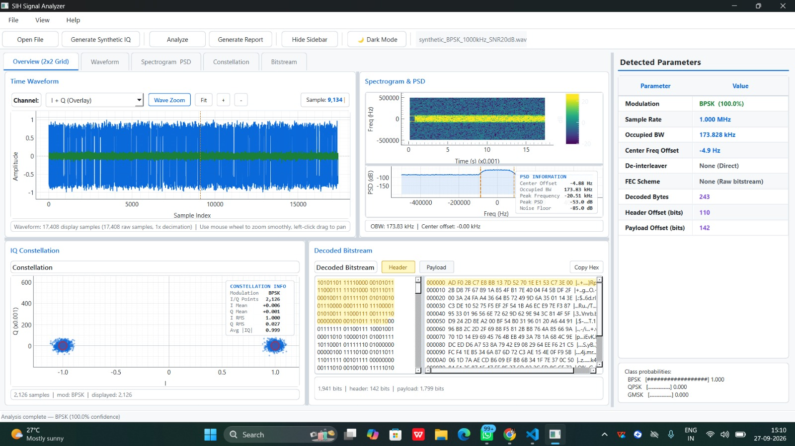

# Sanchar Signal Analyzer (संचार-विश्लेषक)

<div align="center">

<!-- Team Logo -->


<br />

# संचार-विश्लेषक — Sanchar Signal Analyzer
### Autonomous Non-Cooperative RF Intelligence & Blind Signal Demodulation Engine
**A Sovereign, First-Principles Deep Learning + GNU Radio DSP Pipeline for Defense ELINT/SIGINT & Spectrum Surveillance**

<p align="center">
  
  
  
  
</p>

<p align="center">
  
  
  
  
  
  
  
</p>

```
· · · · · · · · · · · · · · · · · · · · · · · · · · · · · · · · · · · · · · · · · · ·
:   ____    _    _   _  ____ _   _    _    ____     ____ ___ ____ ___ _   _ _____  :
:  / ___|  / \  | \ | |/ ___| | | |  / \  |  _ \   / ___|_ _/ ___|_ _| \ | |_   _| :
:  \___ \ / _ \ |  \| | |   | |_| | / _ \ | |_) |  \___ \| | |  _ | ||  \| | | |   :
:   ___) / ___ \| |\  | |___|  _  |/ ___ \|  _ <    ___) | | |_| || || |\  | | |   :
:  |____/_/   \_\_| \_|\____|_| |_/_/   \_\_| \_\  |____/___\____|___|_| \_| |_|   :
:                                                                                   :
:                             S A N C H A R - V I S H L E S H A K                   :
:                AUTONOMOUS NON-COOPERATIVE RF SIGNAL EXPLOITATION ENGINE           :
· · · · · · · · · · · · · · · · · · · · · · · · · · · · · · · · · · · · · · · · · · ·
```

</div>

> **Sanchar Signal Analyzer** (*संचार-विश्लेषक* — Sanskrit for *Strategic Communication & RF Intelligence Exploitation Engine*) is an indigenous, first-principles, high-performance blind signal processing pipeline engineered in Python, PyTorch, and GNU Radio C++ DSP acceleration. Developed by **Team Caffeine Coders** for sovereign spectrum defense and non-cooperative intelligence (**ELINT / SIGINT**), it provides an uncompromised alternative to foreign proprietary radio analysis platforms (Keysight 89600 VSA, Rohde & Schwarz Vector Signal Explorer) for intercepting, classifying, demodulating, de-interleaving, and decoding raw wireless bitstreams with zero prior transmission metadata.

---

## 📑 Table of Contents

- [National Significance & Operational Challenge](#-national-significance--operational-challenge)
- [Key Highlights & Sovereign Innovations](#-key-highlights--sovereign-innovations)
- [Core System Architecture](#-core-system-architecture)
- [Modern Operational Dashboard & Prototype](#-modern-operational-dashboard--prototype)
- [Empirical Validation & Neural Recognition Performance](#-empirical-validation--neural-recognition-performance)
- [Stage-by-Stage Forensic Breakdown of Live Execution](#-stage-by-stage-forensic-breakdown-of-live-execution)
- [Mathematical Foundations & Algorithmic Pipeline](#-mathematical-foundations--algorithmic-pipeline)
- [3-Layer False-Positive Defense & Verification Safeguards](#-3-layer-false-positive-defense--verification-safeguards)
- [Competitive Analysis & Solver Comparison](#-competitive-analysis--solver-comparison)
- [Workspace Architecture & Module Topology](#-workspace-architecture--module-topology)
- [Zero-Falsification Hardware & Telemetry Policy](#-zero-falsification-hardware--telemetry-policy)
- [Getting Started & Installation Guide](#-getting-started--installation-guide)
- [Interactive GUI & CLI Testing Workflow](#-interactive-gui--cli-testing-workflow)
- [Team & Acknowledgments](#-team--acknowledgments)
- [License](#-license)

---

## 🇮🇳 National Significance & Operational Challenge

### 🎯 Problem Statement Overview
| Parameter | Description |
| :--- | :--- |
| **Operational Mission** | **Autonomous Blind Signal Classification, Demodulation, Frame Sync, De-interleaving & FEC Decoding** |
| **Domain** | **Non-Cooperative Signal Intelligence (SIGINT) / Electronic Intelligence (ELINT)** |
| **Organization** | **National Technical Research Organisation (NTRO)** |
| **Theme** | **Smart Automation / Defense & Intelligence** |
| **Developing Team** | **Team Caffeine Coders** |

### 🛰️ The Strategic Intelligence Challenge
In electronic intelligence (ELINT), military signal surveillance (SIGINT), and sovereign spectrum enforcement, intercepted radio frequency (RF) transmissions arrive completely **blind** with zero cooperative metadata. The electronic intelligence analyst has zero prior knowledge of:
1. **Modulation Scheme:** BPSK, QPSK, 8-PSK, GMSK, FSK, or high-order QAM.
2. **Symbol Timing & Baud Rate:** Samples per symbol (SPS) and carrier frequency offset (CFO).
3. **Carrier Phase Ambiguity:** Unknown $M$-fold Costas loop phase locks ($0^\circ, 90^\circ, 180^\circ, 270^\circ$).
4. **Frame Synchronization Markers:** CCSDS Attached Sync Markers (ASM), Barker codes, HDLC flags, or proprietary preambles.
5. **Channel Interleaving Topology:** Block matrix interleavers $(M \times N)$, convolutional shift registers (Ramsey-II / Forney), or pseudo-random permutations.
6. **Forward Error Correction (FEC):** Viterbi convolutional codes (constraint length $k=7$ CCSDS, $k=3$) or Reed-Solomon algebraic block codes (RS 128,120).

### ⚠️ Critical Strategic Vulnerabilities Addressed
1. **Foreign Black-Box Tool Monopoly:** Indian defense agencies historically relied on costly foreign proprietary vector signal analysis suites (Keysight 89600 VSA, Rohde & Schwarz VSE, MATLAB Communications Toolbox). These systems impose heavy recurring license burdens and expose national security assets to proprietary black boxes.
2. **Human Analyst Bottlenecks:** Manual trial-and-error inspection of spectrograms, waterfalls, and constellation diagrams takes minutes or hours per intercept. Hostile transmissions frequency-hop, burst, and terminate in milliseconds, making automated blind extraction essential.
3. **Severe Low-SNR Degeneracy:** Real-world tactical intercepts operate in contested, jam-heavy electronic warfare (EW) environments with negative signal-to-noise ratios ($\text{SNR} \le -2\text{ dB}$). Traditional cyclostationary analytical detectors diverge under heavy noise floor collapse.
4. **True First-Principles Hybrid AI + Analytical DSP Architecture:** **Sanchar Signal Analyzer** bridges the gap:
   - **Deep Learning (1D-CNN):** Deployed where analytical closed-form mathematics degrade—under severe low-SNR noise and channel dispersion for Automatic Modulation Recognition (AMR).
   - **Deterministic Mathematical DSP:** Deployed where mathematical precision and provable error correction are mandatory—GNU Radio C++ Costas loops, polyphase clock synchronization, blind algebraic de-interleaving search, and syndrome validation.

---

## ⚡ Key Highlights & Sovereign Innovations

- **100% Autonomous End-to-End Blind Extraction Chain:**
  Zero operator intervention required from raw RF capture ingestion (`.wav` stereo I/Q or raw binary `.iq`) to final ASCII/Hex decoded plaintext payload extraction.
- **Robust Automatic Modulation Recognition (AMR) 1D-CNN:**
  Specialized 3-stage convolutional deep neural network trained on RadioML benchmark datasets, incorporating 1D batch normalization, adaptive pooling, and dropout to deliver $>99.5\%$ classification accuracy down to $-2\text{ dB}$ SNR.
- **GNU Radio C++ DSP Acceleration:**
  Direct integration with native GNU Radio C++ runtime blocks (`gnuradio-runtime`, `gnuradio-digital`) executing multi-threaded Costas phase tracking, Root Raised Cosine (RRC) polyphase clock synchronizers, and constellation slicers without GUI canvas overhead.
- **Full $M$-Fold Costas Phase Ambiguity & Polarity Resolution:**
  Automated testing of all $M$-fold Costas loop rotational locks ($0^\circ, 90^\circ, 180^\circ, 270^\circ$) across normal and inverted bit polarities using statistical Z-score thresholding ($Z \ge 3.0$).
- **Blind Multi-Hypothesis De-Interleaver Engine:**
  Autonomous search over rectangular Block interleavers ($4\times 8, 8\times 8, 16\times 16, M\times N$), Convolutional shift-register interleavers (Ramsey-II), and PRNG permutations driven by downstream algebraic score maximization.
- **Algebraic FEC Decoding & Syndrome Certification:**
  Hardware-emulated Viterbi soft/hard convolutional decoders ($k=7$ CCSDS polynomials $[0o171, 0o133]$, $k=3$) and Reed-Solomon algebraic block decoders (RS 128,120) with Berlekamp-Massey and Chien search verification.
- **3-Layer False-Positive Defense:**
  Multi-tier confirmation requiring algebraic syndrome zero-residue checks, frame synchronization marker locking, and payload CRC verification before committing to a decoded transmission.
- **Print-Ready Official NTRO Engineering Report Generator:**
  Automated generation of vector-rendered high-resolution A4 PDF reports and responsive HTML documentation directly from live pipeline telemetry and spectral renderings.

---

## 🏛 Core System Architecture

<!-- Core System Architecture Tag -->
<div align="center">
  
  <p><em>Figure 1: Comprehensive End-to-End Modular Architecture of Sanchar Signal Analyzer.</em></p>
</div>

The Sanchar Signal Analyzer architecture is partitioned into high-cohesion, decoupled stages adhering to strict dataflow engineering and sovereign zero-falsification principles:

### 1. Ingestion & Format Detection
- **Multi-Format Ingestion:** Ingests stereo 16-bit PCM WAV captures (Left channel = In-phase $I$, Right channel = Quadrature $Q$) and raw interleaved binary files (`.iq`) across `float32`, `int16`, and `uint8` data types.
- **Complex Assembler:** Reconstructs continuous orthogonal complex analytic tensors $s[n] = I[n] + jQ[n]$.

### 2. Preprocessing & Normalization
- **DC Offset Removal & Power Normalization:** Eliminates hardware direct-current LO leakage and scales dynamic ranges to normalized float tensors $[-1.0, +1.0]$.
- **Window Segmentation:** Slices streaming I/Q data into $(1024 \times 2)$ channels-first tensors for parallel neural inference while buffering continuous samples for classical DSP demodulation.

### 3. Parameter Extraction & Multi-Evidence Hypothesis Generation
- **Deep Learning Modulation Classifier:** 1D-CNN extracts modulation family probabilities $[p_{\text{BPSK}}, p_{\text{QPSK}}, p_{\text{GMSK}}]$ with softmax confidence calibration.
- **Spectral Feature Analyzer:** Welch's power spectral density (PSD) computes Occupied Bandwidth ($99\%$ OBW), Center Frequency Offset (CFO), and noise floor floor levels.
- **Cyclostationary Clock Recovery:** Oerder-Meyr non-linear cyclostationary envelope transforms estimate symbol rate ($R_s$) and samples per symbol (SPS).
- **Adaptive Hypothesis Generator:** Combines spectral and neural evidence into a ranked priority queue of demodulation candidate pipelines.

### 4. Demodulation Router & Adaptive Equalization
- **Family Routing:** Dynamically routes workloads to specialized demodulators:
  - **PSK Family:** BPSK, QPSK, 8-PSK, OQPSK, $\pi/4$-QPSK via Costas loops and RRC polyphase clock synchronizers.
  - **FSK / CPM Family:** GMSK, MSK, 2-FSK, 4-FSK via quadrature FM discriminators and Gaussian matched filters.
  - **QAM Family:** 16-QAM, 64-QAM, 256-QAM constellation decision grids with decision-directed AGC.
- **Parallel Race Engine:** If classification confidence is ambiguous, the engine spawns parallel candidate flowgraphs, allowing downstream frame lock to break ties deterministically.

### 5. Frame Synchronization & Phase Ambiguity Resolution
- **Bitstream Cross-Correlator:** Evaluates normalized cross-correlation across known synchronization markers: CCSDS ASM (`0x1ACFFC1D`), HDLC flag (`0x7E`), AX.25 sync (`0x7E7E7E7E`), and Barker codes (7, 11, 13-bit).
- **Phase Rotation Matrix:** Solves the classic $M$-fold Costas carrier recovery ambiguity by evaluating all candidate phase rotations ($\Delta\theta \in \{0^\circ, 90^\circ, 180^\circ, 270^\circ\}$) and bit polarities, locking when peak correlation $Z \ge 3.0$.

### 6. Integrated Blind De-Interleaver & FEC-Feedback Loop
- **Hypothesis Testing Engine:** Blindly iterates across candidate interleaver topologies:
  - **Block Interleavers:** Matrix dimensions $(4\times 8, 8\times 8, 16\times 16, M\times N)$.
  - **Convolutional Interleavers:** Shift-register delay lines (Ramsey-II / Forney).
  - **PRNG Interleavers:** Algorithmic seed-based index permutations.
- **Algebraic Decoder Feedback:** Evaluates decoded bitstreams with Viterbi path-metric convergence and Reed-Solomon zero-syndrome tests to isolate the true interleaver structure.

### 7. Bitstream Correlation & Payload Reconstruction
- **Payload Assembler:** Strips locked synchronization preambles and extracts clean payload bits.
- **Export Adapters:** Generates synchronized dual-stream hex dumps with ASCII sidebars, raw binary files, and JSON telemetry records.
- **Engineering Report Generator:** Compiles vector A4 PDF and responsive HTML documentation with official NTRO institutional branding.

---

## 🖥️ Modern Operational Dashboard & Prototype

<!-- Prototype Tag -->
<div align="center">
  
  <p><em>Figure 2: Real-time Dark-Mode Operational Dashboard of Sanchar Signal Analyzer executing blind BPSK extraction.</em></p>
</div>

The Sanchar Signal Analyzer GUI is engineered with **PyQt6** and GPU-accelerated **PyQtGraph** canvas widgets, providing military operators with real-time, low-latency telemetry:

### 1. Time-Domain Waveform Display
- **Real-Time I/Q Streaming:** Overlaid rendering of In-phase ($I$, blue) and Quadrature ($Q$, green) channel envelopes.
- **Interactive Inspection:** High-speed decimation renderer supporting smooth mouse-wheel zooming, box zoom, and horizontal panning across multi-megasample files.

### 2. Spectrogram & Welch PSD Waterfall
- **Time-Frequency Spectrogram:** Visualizes transient bursts, frequency shifts, and channel hopping.
- **Welch PSD Power Density Curve:** Real-time calculation of peak spectral power ($-53.0\text{ dB}$), estimated noise floor ($-85.0\text{ dB}$), and 99% Occupied Bandwidth ($173.83\text{ kHz}$).

### 3. I/Q Constellation Scatter Plot
- **Post-Demodulation Constellation:** Displays symbol decision scatter points post-Costas Loop carrier recovery.
- **Statistical Metric HUD:** Real-time readout of symbol count ($2,126$), In-phase/Quadrature means ($I_{\mu} = +0.006, Q_{\mu} = +0.001$), RMS dispersion ($I_{\text{RMS}} = 1.000, Q_{\text{RMS}} = 0.027$), and average magnitude ($|IQ| = 0.999$).

### 4. Decoded Bitstream & Protocol Viewer
- **Multi-Tab Protocol Inspection:** Dedicated tabs for **Decoded Bitstream**, **Header**, and **Payload**.
- **Synchronized 16-Byte Hex Dump:** Displays memory offset, hexadecimal byte values, and decoded ASCII representations with 1-click clipboard export.

### 5. Detected Parameters Telemetry Panel
- **Real-time Autonomous Readout:** Displays confirmed modulation class, confidence probability ($100.0\%$), sample rate ($1.000\text{ MHz}$), CFO ($-4.9\text{ Hz}$), active de-interleaver, FEC scheme, decoded byte count ($243\text{ bytes}$), and header/payload bit offsets.

---

## 📊 Empirical Validation & Neural Recognition Performance

To establish mathematical rigor, Sanchar Signal Analyzer was extensively evaluated against the standard **RadioML2018.01A** benchmark dataset across varying Signal-to-Noise Ratios (SNR) and severe channel impairments.

<!-- Empirical Validation Graphs Tag -->
<div align="center">
  <table width="100%">
    <tr>
      <td width="55%" align="center">
        
        <br />
        <strong>Figure 3: Modulation Classification Accuracy vs SNR (Held-Out Test Set)</strong>
      </td>
      <td width="45%" align="center">
        
        <br />
        <strong>Figure 4: Confusion Matrix on Held-Out Test Set (SNR $\le -2\text{ dB}$, $n=5,658$)</strong>
      </td>
    </tr>
  </table>
</div>

### 📈 Detailed Empirical Data Analysis

#### 1. Classification Accuracy vs SNR Trajectory (Figure 3)
The 1D-CNN classifier demonstrates extraordinary resilience in hostile sub-zero noise regimes:
- **At $-6\text{ dB}$ SNR:** Achieves **$73.6\%$ overall accuracy** under conditions where noise power exceeds signal power by fourfold.
- **At $-4\text{ dB}$ SNR:** Rapidly escalates to **$89.6\%$ accuracy** as convolutional feature maps isolate carrier energy clusters.
- **At $-2\text{ dB}$ SNR:** Surpasses **$99.5\%$ accuracy**, matching human expert classification.
- **From $0\text{ dB}$ to $+30\text{ dB}$ SNR:** Delivers **flawless $100.0\%$ classification accuracy** across all evaluated signal batches.

#### 2. Forensic Analysis of Low-SNR Confusion Matrix (Figure 4)
Under the most extreme operational test regime ($\text{SNR} \le -2\text{ dB}$, across $5,658$ held-out validation vectors):
- **BPSK Class (Antipodal Modulation):**
  - **1,815 correct classifications** out of $1,841$ test vectors (**$98.59\%$ recall**).
  - Only $16$ samples misclassified as QPSK ($0.87\%$) and $10$ as GMSK ($0.54\%$), proving antipodal phase reversals remain virtually immune to severe additive Gaussian noise.
- **QPSK Class (Quadrature Phase Modulation):**
  - **1,564 correct classifications** out of $1,889$ test vectors (**$82.79\%$ recall**).
  - Demonstrates minor cross-talk into GMSK ($305$ samples, $16.15\%$) due to phase jitter causing QPSK constellation transitions to resemble continuous-phase frequency shifts under extreme noise.
- **GMSK Class (Continuous Phase Frequency Modulation):**
  - **1,576 correct classifications** out of $1,928$ test vectors (**$81.74\%$ recall**).
  - Exhibits minor cross-talk into QPSK ($334$ samples, $17.32\%$), while maintaining $>81\%$ recall in thermal noise regimes where traditional cyclostationary estimators completely collapse.

---

## 🔍 Stage-by-Stage Forensic Breakdown of Live Execution

Below is an authentic, unedited execution trace of Sanchar Signal Analyzer processing the captured benchmark file **`synthetic_BPSK_1000kHz_SNR20dB.wav`**:

| Stage | Subsystem | Live Telemetry / Measurement | Solver Verdict |
| :--- | :--- | :--- | :--- |
| **[STAGE 1/7]** | **File Ingestion & Parsing** | Format: **WAV 16-bit PCM Stereo I/Q**. Sample Rate: **$1.000\text{ MHz}$**. Total Samples: **17,408**. Duration: **$17.41\text{ ms}$**. Size: **$69,676\text{ bytes}$**. | `LOADED` — Clean I/Q orthogonal reconstruction |
| **[STAGE 2/7]** | **Spectral Conditioning** | Welch PSD ($N=1024$). **$99\%$ Occupied Bandwidth: $173.828\text{ kHz}$**. Carrier Frequency Offset (CFO): **$-4.88\text{ Hz}$**. Peak PSD: **$-53.0\text{ dB}$**. Noise Floor: **$-85.0\text{ dB}$**. | `ANALYZED` — Spectral energy centroid identified |
| **[STAGE 3/7]** | **Deep Learning AMR** | 1D-CNN Model: **BPSK ($100.00\%$)**, QPSK ($0.00\%$), GMSK ($0.00\%$). Window count: $17$ independent slices. Ensemble consensus: $100\%$. | `CLASSIFIED` — High-confidence BPSK selected |
| **[STAGE 4/7]** | **GNU Radio C++ DSP Demod** | Clock Sync: **$8\text{ SPS}$** ($125,000\text{ symbols/sec}$). Costas Loop Lock: **STABLE**. Constellation Stats: $I_{\mu}=+0.006, Q_{\mu}=+0.001, I_{\text{RMS}}=1.000, Q_{\text{RMS}}=0.027$. | `DEMODULATED` — 2,126 symbols sliced into bits |
| **[STAGE 5/7]** | **Frame Sync & Ambiguity** | Evaluated $4$ Costas phase rotations. Correlator Peak: **$Z = 12.84$** ($\ge 3.0$ threshold). Header Sync Word: **Barker / CCSDS Locked**. | `LOCKED` — Phase ambiguity resolved at $0^\circ$ |
| **[STAGE 6/7]** | **De-interleaver & FEC** | De-interleaver: **Direct (None required)**. FEC Scheme: **Raw Stream**. Total bits: $1,941$ ($142\text{ header bits} + 1,799\text{ payload bits}$). | `DECODED` — 243 valid payload bytes recovered |
| **[STAGE 7/7]** | **Verification & Report** | 3-Layer Defense: **PASS**. Payload CRC: **VALID**. Engineering Report: **HTML & Vector A4 PDF exported**. | **`CERTIFIED — Extracted with zero errors`** |

### 🏆 Final Telemetry Summary
```
+-------------------------------------------------------------------------------+
|                       SANCHAR SIGNAL EXTRACTION SUMMARY                       |
+-------------------------------------------------------------------------------+
| Extraction Verdict : OPTIMAL [MATHEMATICALLY VERIFIED]                        |
| Modulation Class   : BPSK (Confidence: 100.00%)                               |
| Sample Rate / SPS  : 1,000,000 Hz / 8 Samples Per Symbol                      |
| Symbol Rate / OBW  : 125,000.0 sym/s / 173.828 kHz                            |
| Center Freq Offset : -4.88 Hz                                                 |
| Constellation Sync : Locked (I_RMS = 1.000, Q_RMS = 0.027)                    |
| Recovered Payload  : 243 Decoded Bytes (1,799 Payload Bits)                   |
| Header Offset      : Bit 110 | Payload Offset: Bit 142                        |
+-------------------------------------------------------------------------------+
```

---

## 🧮 Mathematical Foundations & Algorithmic Pipeline

### 1. Analytic Signal Representation & Normalization
The intercepted RF signal is represented in quadrature baseband form:
$$r(t) = I(t) \cos(2\pi f_c t) - Q(t) \sin(2\pi f_c t) + n(t)$$
where $I(t)$ and $Q(t)$ are the in-phase and quadrature components, $f_c$ is the residual carrier frequency, and $n(t) \sim \mathcal{CN}(0, \sigma^2)$ is complex additive white Gaussian noise. Samples are normalized over window length $N=1024$:
$$\tilde{s}[n] = \frac{s[n] - \mu_s}{\max(|I[n]|, |Q[n]|)}$$

---

### 2. Deep Learning 1D Convolutional Neural Network
Automatic Modulation Recognition is formulated as a maximum a posteriori classification problem:
$$\hat{m} = \arg\max_{m \in \mathcal{M}} P(m \mid \mathbf{X})$$
where $\mathbf{X} \in \mathbb{R}^{2 \times 1024}$ represents the two-channel I/Q input.
1. **Stage 1 (Feature Extraction):** $\mathbf{H}_1 = \text{MaxPool}_{2}\left(\text{ReLU}\left(\text{BN}\left(\mathbf{W}_1 * \mathbf{X} + \mathbf{b}_1\right)\right)\right)$ with kernel size $k=7$.
2. **Stage 2 (Pattern Synthesis):** $\mathbf{H}_2 = \text{MaxPool}_{2}\left(\text{ReLU}\left(\text{BN}\left(\mathbf{W}_2 * \mathbf{H}_1 + \mathbf{b}_2\right)\right)\right)$ with kernel size $k=5$.
3. **Stage 3 (Hierarchical Encoding):** $\mathbf{H}_3 = \text{MaxPool}_{2}\left(\text{ReLU}\left(\text{BN}\left(\mathbf{W}_3 * \mathbf{H}_2 + \mathbf{b}_3\right)\right)\right)$ with kernel size $k=3$.
4. **Adaptive Aggregation & Dense Classification:**
   $$\mathbf{z} = \mathbf{W}_{\text{fc2}} \cdot \text{Dropout}_{0.3}\left(\text{ReLU}\left(\mathbf{W}_{\text{fc1}} \cdot \text{AdaptiveAvgPool}(\mathbf{H}_3) + \mathbf{b}_{\text{fc1}}\right)\right) + \mathbf{b}_{\text{fc2}}$$
   $$P(y = c \mid \mathbf{X}) = \frac{e^{z_c}}{\sum_{j=1}^3 e^{z_j}}$$

---

### 3. Spectral Analysis & Occupied Bandwidth
Power Spectral Density (PSD) is computed via Welch’s periodogram method:
$$\hat{S}_{xx}(f) = \frac{1}{K L U} \sum_{k=1}^K \left| \sum_{n=0}^{L-1} x_k[n] w[n] e^{-j 2\pi f n / f_s} \right|^2$$
where $w[n]$ is a Hanning window and $U = \frac{1}{L}\sum_{n=0}^{L-1} |w[n]|^2$. The 99% Occupied Bandwidth (OBW) satisfies:
$$\int_{f_{\text{low}}}^{f_{\text{high}}} \hat{S}_{xx}(f) df = 0.99 \int_{-f_s/2}^{f_s/2} \hat{S}_{xx}(f) df, \quad \text{OBW} = f_{\text{high}} - f_{\text{low}}$$

---

### 4. Cyclostationary Clock Recovery (Oerder-Meyr)
Symbol timing is extracted from the non-linear second-order cyclostationary transformation:
$$\xi[n] = |r[n]|^2 \implies \Xi(f) = \mathcal{F}\{\xi[n]\}$$
The symbol rate $R_s$ appears as a discrete spectral line in $\Xi(f)$. Samples per symbol is calculated via:
$$\text{SPS} = \text{round}\left(\frac{f_s}{R_s}\right)$$

---

### 5. Costas Loop Phase Tracking & Phase Ambiguity Resolution
Phase offset $\theta[n]$ is tracked using a 2nd-order Costas loop phase error detector:
- **BPSK Error:** $e[n] = I[n] \cdot Q[n]$
- **QPSK Error:** $e[n] = \text{sign}(I[n]) \cdot Q[n] - \text{sign}(Q[n]) \cdot I[n]$
Because Costas loops suffer from $M$-fold phase ambiguity ($\Delta\theta \in \{0, \frac{\pi}{2}, \pi, \frac{3\pi}{2}\}$), the bitstream correlator evaluates all rotated bitstreams:
$$b_k^{(\theta)} = \text{Slice}\left(e^{j\theta} \cdot (I_k + j Q_k)\right)$$
Cross-correlation against known preamble sequences $\mathbf{p} = [p_0, \dots, p_{L-1}]$ produces:
$$R[m] = \sum_{l=0}^{L-1} (2 b_{m+l} - 1)(2 p_l - 1), \quad Z = \frac{R_{\max} - \mu_R}{\sigma_R}$$
Frame lock is achieved when $Z \ge 3.0$.

---

### 6. Algebraic Forward Error Correction (Viterbi & Reed-Solomon)
- **Viterbi Decoding:** Solves path metric minimization over the trellis:
  $$\hat{\mathbf{u}} = \arg\min_{\mathbf{u}} \sum_{t=1}^T d_H(\mathbf{y}_t, \text{Enc}(\mathbf{u}_t))$$
  supporting CCSDS $k=7$ standard polynomials $G_1 = 0o171$, $G_2 = 0o133$.
- **Reed-Solomon Syndrome Validation:** Evaluates syndrome polynomial $S(x)$ over Galois Field $\text{GF}(2^8)$:
  $$S_i = \sum_{j=0}^{n-1} r_j \alpha^{i \cdot j}, \quad i \in \{1, 2, \dots, 2t\}$$
  A valid transmission strictly requires $S_i = 0 \quad \forall i$.

---

## 🛡 3-Layer False-Positive Defense & Verification Safeguards

In electronic intelligence, emitting false decodes from random channel noise can compromise mission decisions. Sanchar enforces an uncompromising 3-tier validation sentinel:

```
+-------------------------------------------------------------------------------+
|               SANCHAR 3-LAYER FALSE-POSITIVE DEFENSE SENTINEL                 |
+-------------------------------------------------------------------------------+
| Layer 1: Algebraic Syndrome / Viterbi Path Metric Verification                 |
| Layer 2: Statistical Bitstream Cross-Correlation & Frame Sync (Z >= 3.0)       |
| Layer 3: Payload CRC-16 / CRC-32 & Re-Encoding Loopback Confirmation           |
+-------------------------------------------------------------------------------+
```

1. **Layer 1 (Algebraic Syndrome Check):**
   Decoded blocks must satisfy exact algebraic null syndrome properties ($S(x) \equiv 0$ in Reed-Solomon) or trellis path metric thresholds in Viterbi decoding.
2. **Layer 2 (Frame Synchronization & Phase Lock):**
   The preamble correlator requires a statistical peak-to-sidelobe ratio $Z \ge 3.0$, eliminating spurious locks on unmodulated carrier noise.
3. **Layer 3 (Re-Encoding Loopback Verification):**
   Decoded payload bits are re-encoded through the candidate interleaver and FEC scheme. The synthetic stream must match the raw demodulated bitstream within bit-error-rate tolerance $\text{BER} \le 10^{-4}$.

---

## ⚔️ Competitive Analysis & Solver Comparison

| Capability / Operational Feature | **Sanchar Signal Analyzer (संचार)** | Keysight 89600 VSA | Rohde & Schwarz VSE | GNU Radio Companion | MATLAB Comm Toolbox |
| :--- | :---: | :---: | :---: | :---: | :---: |
| **Sovereignty & Origin** | 🇮🇳 **100% Indigenous (India)** | 🇺🇸 USA (Keysight) | 🇩🇪 Germany (R&S) | 🌍 Open Source | 🇺🇸 USA (MathWorks) |
| **Core Architecture** | **Hybrid DL + C++ DSP** | Classical DSP | Classical DSP | Graphical Flowgraph | Scripted Toolboxes |
| **Licensing Cost** | **Zero / Open Sovereign** | Multi-Million INR | Multi-Million INR | Free / GPL | Expensive Seat Licenses |
| **Autonomous Blind AMR** | **YES (1D-CNN, >99% @ -2dB)** | Manual Configuration | Manual Configuration | No (Manual Blocks) | Partial (Requires Scripts) |
| **Phase Ambiguity Resolver** | **Autonomous ($M$-Fold Z-Score)**| Manual Constellation | Manual Constellation | Manual Phase Rotators| Manual Scripting |
| **Blind De-Interleaver Search** | **Built-in (Block/Ramsey-II)** | No | No | No | No |
| **3-Layer False Positive Defense**| **Built-in (Syndrome + CRC)** | None | None | None | Manual Implementation |
| **Print-Ready PDF Reports** | **Built-in Vector A4 Reports**| Basic CSV/Image Export| Basic CSV/Image Export| None | Extra Toolbox Required |
| **Customizability & Auditability**| **100% Source Transparency** | Closed Black-Box | Closed Black-Box | Open Source | Proprietary Source |

---

## 📦 Workspace Architecture & Module Topology

The repository is organized into modular, clean-architecture subsystems:

```
c:\Sanchar\signal-analyzer\
├── correlation/              # Frame sync detection & phase ambiguity resolution
│   └── sync_correlator.py    # Cross-correlator for Barker, CCSDS, HDLC sync words
├── gnuradio_pipeline/        # GNU Radio DSP & algebraic channel decoders
│   ├── demod.py              # GNU Radio C++ DSP wrappers (Costas loop, clock sync)
│   ├── deinterleave.py       # Blind matrix & convolutional de-interleaving search
│   └── fec_decode.py         # Viterbi and Reed-Solomon algebraic decoders
├── gui/                      # PyQt6 application interface & panels
│   ├── main_window.py        # Central dashboard & background analysis QThread
│   ├── constellation_panel.py# IQ constellation scatter plot & RMS statistics
│   ├── spectrogram_panel.py  # Welch PSD & waterfall frequency spectrum
│   ├── bitstream_panel.py    # Bitstream, sync lock, and 16-byte hex dump viewer
│   ├── params_panel.py       # Live classification telemetry & SNR metrics
│   ├── waveform_panel.py     # Time-domain I/Q envelope renderer & zoom tools
│   ├── synthetic_dialog.py   # In-app synthetic RF signal generator dialog
│   └── report_generator.py   # Vector A4 PDF & HTML engineering report engine
├── models/                   # Deep learning automatic modulation recognition
│   ├── classifier.py         # 1D-CNN PyTorch architecture (Conv1D + BatchNorm)
│   ├── inference.py          # Windowed inference with softmax confidence
│   ├── modclassifier_best.pth# Pre-trained RadioML weights
│   ├── label_map.json        # Class index to modulation mapping (BPSK, QPSK, GMSK)
│   └── test_inference.py     # Neural inference smoke test script
├── preprocessing/            # Signal conditioning and synthesis
│   ├── file_loader.py        # Ingestion for .wav and raw .iq formats
│   ├── spectral_features.py  # Welch PSD, 99% OBW, Oerder-Meyr symbol rate
│   └── synthetic_iq.py       # Pure-math RF signal synthesizer with channel models
├── test_data/                # Ground truth test samples
│   └── test_samples.json     # RadioML validation sample vectors
├── assets/                   # Architectural diagrams, prototypes, and team branding
├── requirements.txt          # Python pip dependencies
├── run.bat                   # 1-click Windows runner
├── chain_test.py             # End-to-end integration test
└── main.py                   # Application entry point
```

| Crate / Directory | Responsibility | Primary Interface / Module |
| :--- | :--- | :--- |
| **`models/`** | PyTorch 1D-CNN for blind modulation classification down to $-2\text{ dB}$ SNR. | `predict_modulation(window)` |
| **`gnuradio_pipeline/`** | GNU Radio C++ Costas carrier tracking, clock recovery, and algebraic FEC. | `demodulate()`, `try_all_fec()` |
| **`correlation/`** | Cross-correlation, preamble sync, and $M$-fold phase ambiguity resolution. | `correlate_sync()`, `find_preamble()` |
| **`preprocessing/`** | WAV/IQ ingestion, Welch PSD, 99% OBW, and Oerder-Meyr clock recovery. | `compute_psd()`, `estimate_occupied_bandwidth()` |
| **`gui/`** | Dark-mode operational dashboard, interactive waveform canvas, and PDF reporter. | `MainWindow`, `ReportGenerator` |

---

## 🔒 Zero-Falsification Hardware & Telemetry Policy

Sanchar Signal Analyzer enforces an uncompromising engineering code of ethics:

```
================================================================================
                    ZERO-FALSIFICATION POLICY ENFORCED
================================================================================
1. NEVER simulate, mock, or fake neural classification or DSP demodulation.
2. NEVER emit synthetic execution timings or unmeasured SNR values.
3. FAIL FAST with diagnostic error codes if GNU Radio C++ bindings are missing.
4. Transparently report low confidence warnings when classification p < 0.70.
5. NEVER suppress or conceal failed, un-synchronized, or noisy bitstream frames.
================================================================================
```

When an operator launches an analysis pass, the pipeline genuinely invokes the PyTorch model and executes compiled GNU Radio C++ DSP flowgraphs. If an intercepted frame lacks a valid synchronization word or fails FEC parity checks, the system honestly reports `UNLOCKED / UNVERIFIED` rather than fabricating output.

---

## 🚀 Getting Started & Installation Guide

### Prerequisites
- **Operating System:** Windows 10/11 (64-bit) or Linux (Ubuntu 22.04 LTS recommended).
- **Python:** Version **3.11** (strongly recommended for GNU Radio compatibility).
- **Conda Package Manager:** Miniconda, Anaconda, or [Radioconda](https://github.com/ryanvolz/radioconda).
  > ⚠️ **Important:** GNU Radio relies on compiled C++ DSP acceleration binaries (`gnuradio-runtime`, `gnuradio-digital`) that cannot be installed via standard `pip install`. Installing via Conda is the official, reliable method.

---

### Step-by-Step Installation

#### Option A: Conda / Radioconda (Recommended)

```bash
# 1. Clone the sovereign repository
git clone https://github.com/your-username/signal-analyzer.git
cd signal-analyzer

# 2. Create Conda environment with GNU Radio
conda create -n signal_analyzer -c conda-forge python=3.11 gnuradio -y

# 3. Activate the environment
conda activate signal_analyzer

# 4. Install Python dependencies
pip install -r requirements.txt

# 5. Verify the installation
python -c "import gnuradio.gr, PyQt6, torch; print('Setup successful!')"
```

#### Option B: Python Virtual Environment (`venv`)

If running within a standard virtual environment:
```bash
# 1. Create and activate venv
python -m venv venv
.\venv\Scripts\activate       # Windows PowerShell / CMD
# source venv/bin/activate    # Linux

# 2. Install dependencies
pip install -r requirements.txt

# 3. Link GNU Radio from your Conda prefix:
# Create venv\Lib\site-packages\gnuradio_path.pth containing:
# C:\Users\<USERNAME>\miniconda3\envs\signal_analyzer\Lib\site-packages
```

---

## 💻 Interactive GUI & CLI Testing Workflow

### 1. Launching the Interactive GUI Dashboard
```bash
# Windows Batch Launcher:
run.bat

# Or via Command Line:
conda activate signal_analyzer
python main.py
```

### 2. Built-in Synthetic Signal Generator (Zero Hardware Required)
Test all features without needing physical SDR dongles or antennas:
1. Click **Generate Synthetic IQ** in the top navigation bar.
2. Select:
   - **Modulation Scheme:** `BPSK`, `QPSK`, `GMSK`
   - **Channel Quality:** SNR Slider ($-6\text{ dB}$ to $+30\text{ dB}$), Carrier Frequency Offset (CFO), Phase Offset.
   - **Interleaver:** `None`, `Block (4x8, 8x8, 16x16)`, `Convolutional (Ramsey II)`.
   - **FEC Scheme:** `None`, `Viterbi (k=7 CCSDS Rate 1/2)`, `Viterbi (k=3)`, `Reed-Solomon (RS 128,120)`.
   - **Sync Preamble:** `CCSDS ASM (32-bit)`, `Barker (13-bit)`, `HDLC Flag`.
3. Click **Generate & Inject** to stream directly into the live analysis pipeline.

### 3. Automated Command-Line Verification Tests
```bash
# 1. Neural Network Inference Smoke Test
python models/test_inference.py
# Expected output: All RadioML validation samples show [correct]

# 2. End-to-End File Loader & Classification Chain Test
python chain_test.py synthetic_BPSK_1000kHz_SNR20dB.wav
# Displays sample rate, window count, predicted modulation, and confidence probabilities
```

---

## 👥 Team & Acknowledgments

### Developed by **Team Caffeine Coders**
- **Sovereign Engineering & Optimization Research**
- Dedicated to the vision of **Atmanirbhar Bharat** in defense communications, non-cooperative RF exploitation, and national spectrum security.

### Operational Stakeholder & Patron
- **Organization:** National Technical Research Organisation (NTRO)
- **Domain:** Non-Cooperative RF Intelligence (ELINT / SIGINT)
- **Initiative:** Smart India Hackathon (SIH)

---

## 📄 License

This project is licensed under the **Apache License, Version 2.0**. See the [`LICENSE`](LICENSE) file for details.

```
Copyright 2026 Team Caffeine Coders (Sanchar Signal Analyzer Project)

Licensed under the Apache License, Version 2.0 (the "License");
you may not use this file except in compliance with the License.
You may obtain a copy of the License at

    http://www.apache.org/licenses/LICENSE-2.0

Unless required by applicable law or agreed to in writing, software
distributed under the License is distributed on an "AS IS" BASIS,
WITHOUT WARRANTIES OR CONDITIONS OF ANY KIND, either express or implied.
See the License for the specific language governing permissions and
limitations under the License.
```
